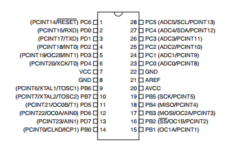
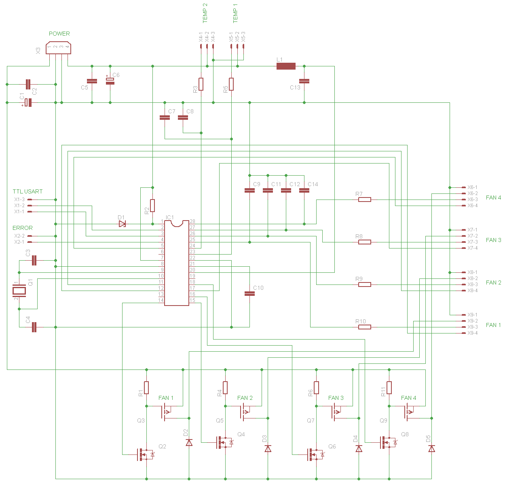
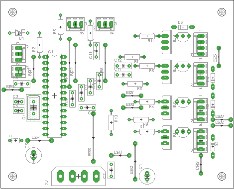
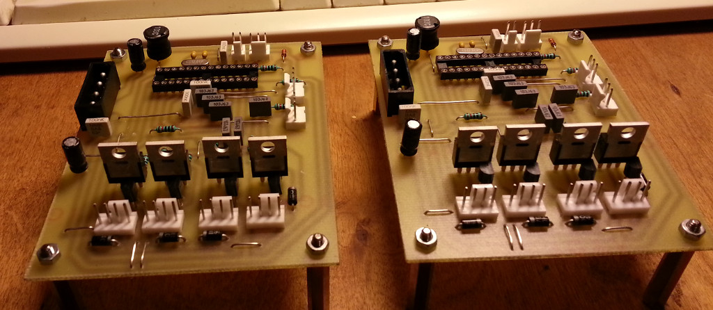
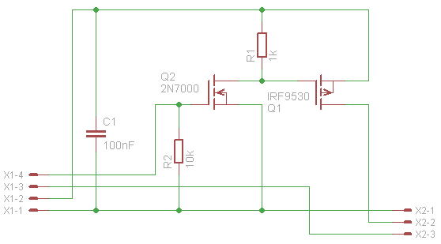

# avrcooling

PC cooling controller for rotary cooling devices (fans/pumps). It has
the following features:

 * Supports 4 cooling devices.
 * Can disable devices that still run on minimal PWM.
 * Monitors devices RPM.
 * RPM measurement supports pulse stretching.
 * Supports 2 thermal sensors.
 * Error signal output.
 * Can be controlled/queried over RS-232 interface.
 * Command-line client to query/debug/control the device.
 * Hardware design and source code is MIT-licensed.

### Control algorithm

The control algorithm uses 2 [decision tables](http://en.wikipedia.org/wiki/Decision_table),
one per thermal sensor. Table rows contain the following information:

 * enabled - whether the control row is enable.
 * min_temp - lower bound for activating the control row.
 * max_temp - upper bound for activating the control row.
 * affect_fan0 - whether to apply the row to fan 0.
 * affect_fan1 - whether to apply the row to fan 1.
 * affect_fan2 - whether to apply the row to fan 2.
 * affect_fan3 - whether to apply the row to fan 3.
 * fan0_pwm - PWM value to apply for fan 0.
 * fan1_pwm - PWM value to apply for fan 1.
 * fan2_pwm - PWM value to apply for fan 2.
 * fan3_pwm - PWM value to apply for fan 3.

There are 5 rows in each table. The first row with
min_temp...max_temp range including the current temperature is used for
applying the control values.

All cooling fans start initially in disabled state and with
0 PWM. When a fan PWM is set to value > 0 then the fan power is
enabled. When PWM is set to 0 then the fan is also powered down.

Control table rows are checked periodically. The rows can be
read and updated using the command-line PC app described below.

## Project structure

The project is divided into 3 subdirectories:

 * `avr` - source for microcontroller binary.
 * `hw` - physical hardware design.
 * `pc` - NodeJS command-line app for communication.

## Hardware

### Pin allocation



 * pin  1: reset, connected to VCC and protected by zener diode
 * pin  2: USART RX line (pullup?)
 * pin  3: USART TX line
 * pin  4: PD2, Error signal output
 * pin  5: PD3, OC2B, fan 4 PWM output
 * pin  6: PD4, not connected
 * pin  7: VCC
 * pin  8: GND
 * pin  9: XTAL 1
 * pin 10: XTAL 2
 * pin 11: PD5, OC0B, fan 2 PWM output
 * pin 12: PD6, OC0A, fan 1 PWM output
 * pin 13: PD7, not connected
 * pin 14: PB0, fan 1 enable
 * pin 15: PB1, fan 2 enable
 * pin 16: PB2, fan 3 enable
 * pin 17: PB3, fan 3 PWM output
 * pin 18: PB4, fan 4 enable
 * pin 19: PB5, not connected
 * pin 20: AVCC, connected to VCC through low-pass filter L1/C13
 * pin 21: AREF, analog reference, decoupled with 100nF cap C10
 * pin 22: GND
 * pin 23: PC0, ADC0, temperature sensor 1 input, low-pass filter R5/C7
 * pin 24: PC1, ADC1, temperature sensor 2 input, low-pass filter R3/C8
 * pin 25: PC2, fan 1 RPM input, pull-up, low-pass filter R10/C9
 * pin 26: PC3, fan 2 RPM input, pull-up, low-pass filter R9/C11
 * pin 27: PC4, fan 3 RPM input, pull-up, low-pass filter R8/C12
 * pin 28: PC5, fan 4 RPM input, pull-up, low-pass filter R7/C14

### Port directions

#### Port B

 * PB0 - output (fan 1 enable)
 * PB1 - output (fan 2 enable)
 * PB2 - output (fan 3 enable)
 * PB3 - output (fan 3 PWM)
 * PB4 - output (fan 4 enable)
 * PB5 - output (not connected)
 * PB6 - output (overriden by xtal)
 * PB7 - output (overriden by xtal)

#### Port C

 * PC0 - input (ADC)
 * PC1 - input (ADC)
 * PC2 - input (fan 1 RPM, pull-up)
 * PC3 - input (fan 2 RPM, pull-up)
 * PC4 - input (fan 3 RPM, pull-up)
 * PC5 - input (fan 4 RPM, pull-up)
 * PC6 - input (default reset config)
 * PC7 - not in circuit/registry

#### Port D

 * PD0 - output (overriden by USART)
 * PD1 - output (overriden by USART)
 * PD2 - output (error)
 * PD3 - output (fan 4 PWM)
 * PD4 - output (not connected)
 * PD5 - output (fan 2 PWM)
 * PD6 - output (fan 1 PWM)
 * PD7 - output (not connected)

### Full schematics

Full schematics in Eagle format can be found in the file `hw/schematics.sch`.



#### Part list

 * C1 10uF/16V
 * C2 100nF/63V 5mm
 * C3, C4 22pF/63V 2.54mm
 * C5 100nF/63V 5mm
 * C6 10uF/16V 5mm
 * C7, C8 10nF/100V 5mm
 * C9, C11, C12, C14 10nF/63V 5mm
 * C10 100nF/63V 5mm
 * C13 100nF/63V 5mm
 * D1 5.1V zener 7.62mm
 * D2, D3, D4, D5 2N4007
 * IC1 Atmega88 DIP28
 * R1, R2, R3, R4, R5, R6, R7, R8, R9, R10, R11 10k
 * Q1 12MHz
 * Q2, Q4, Q6, Q8 2N7000
 * Q3, Q5, Q7, Q9 IRF9530
 * L1 10uH
 * X3 molex power connector, [Farnell product page](http://uk.farnell.com/jsp/search/productdetail.jsp?SKU=1391827)
 * X6, X7, X8, X9 molex 47053-1000 headers, [Farnell product page](http://uk.farnell.com/jsp/search/productdetail.jsp?SKU=2313705)

### Board layout

Board layout in Eagle format can be found in the file `hw/board.brd`. Layout
suitable for tone-transfer can be found in the PDF file `hw/board.pdf`.



Photo of 2 completed units:



### Fan connectors

4-wire connectors are standardized in the [specification](http://www.formfactors.org/developer%5Cspecs%5C4_Wire_PWM_Spec.pdf).
Connector pinout with typical wire colors is:

 * 1 - GND - black
 * 2 - 12V - yellow
 * 3 - RPM - green
 * 4 - PWM - blue


#### 3-wire connectors

3-wire connectors lack PWM signal but are otherwise compatible with
4-wire headers. Pinout:

 * 1 - GND - black
 * 2 - 12V - red
 * 3 - RPM - yellow

While a 3-wire fan lacks PWM control, it can still be made variable-speed by
modulating the supply voltage. This can be implemented with the following
circuit:



### RS-232 interface

The RS-232 interface is used for updating the control line tables and
for debugging the device. The connector is denoted as X1 on schematics
and board and has the following pinout:

 * 1 - TX line
 * 2 - RX line
 * 3 - GND

A level translator has to be used for connecting the device to PC. PC
uses signal levels -12V/+12V while the device uses normal TTL levels 0V/5V.

A level translator can be built using the [MAX232](http://www.ti.com/lit/ds/symlink/max232.pdf)
chip or using a prebuilt module/cable/converter. There are various circuits and
building instructions on the Internet.

### Compiling firmware

The project contains a Makefile that includes build targets
with [avr-gcc](http://www.nongnu.org/avr-libc/) compiler.

To build the HEX binary for the controller:

    cd avr
    make

If [avrdude](http://www.nongnu.org/avrdude/) is installed then the hex file
can be burned into the device with the command:

    make burn

### Fuses

 * Clock selection: external full swing crystal (CKSEL 0111).
 * Slow raising power: SUT 11.
 * No clock division by 8.
 * Low fuse result: 0xf7.

If avrdude is installed then correct fuses can be burned
using the command:

    make burn-fuse

## Client

The client application is used for updating the control table lines
and for debugging the device.

Client options and supported commands:

```
Usage: avrcooling --port <port> --command <command> [arguments]
Recognized commands:
  disable0       disable fan 0
  disable1       disable fan 1
  disable2       disable fan 2
  disable3       disable fan 3
  echo           sends and receives the given byte
  enable0        enable fan 0
  enable1        enable fan 1
  enable2        enable fan 2
  enable3        enable fan 3
  nostretch0     disable pulse stretch for fan 0
  nostretch1     disable pulse stretch for fan 1
  nostretch2     disable pulse stretch for fan 2
  nostretch3     disable pulse stretch for fan 3
  pwm0_get       query fan 0 PWM level (0-255)
  pwm0_set       set fan 0 PWM (0-255)
  pwm1_get       query fan 1 PWM level (0-255)
  pwm1_set       set fan 1 PWM (0-255)
  pwm2_get       query fan 2 PWM level (0-255)
  pwm2_set       set fan 2 PWM (0-255)
  pwm3_get       query fan 3 PWM level (0-255)
  pwm3_set       set fan 3 PWM (0-255)
  rpm0           query fan 0 RPM
  rpm1           query fan 1 RPM
  rpm2           query fan 2 RPM
  rpm3           query fan 3 RPM
  stretch0       enable pulse stretch for fan 0
  stretch1       enable pulse stretch for fan 1
  stretch2       enable pulse stretch for fan 2
  stretch3       enable pulse stretch for fan 3
  stretch_info   query pulse stretch settings
  temp0          query sensor 0 temperature
  temp0_line_get get control table line (0-4) for sensor 0
  temp0_line_set set control table line (0-4) for sensor 0
  temp1          query sensor 1 temperature
  temp1_line_get get control table line (0-4) for sensor 1
  temp1_line_set set control table line (0-4) for sensor 1

```

### Debugging

Set environment variable `DEBUG=*` and run the command.

    DEBUG=* avrcooling ...

### Installation

Assuming that you have [NodeJS](https://nodejs.org/) installed:

    npm install -g avrcooling

### Protocol

The client-device communication protocol terminates messages with line ends.
Data on individual lines is encoded in the hex encoding.

Decoded commands have the following format:

    [command_byte, arguments..., checksum_byte]

Responses have the following format:

    [response_ok, response arguments..., checksum_byte]

or

    [response_fail, checksum_byte]

or

    [command_checksum_fail, checksum_byte]

Multibyte integers are sent in big-endian format. Maximum decoded message length is 10 bytes.
The detailed description of the protocol is found in [pc/lib/commands.js](pc/lib/commands.js).

The checksum computation uses the Pearson hash algorithm:
<http://en.wikipedia.org/wiki/Pearson_hashing>. The constants
table can be found in [avr/src/pearson.c](avr/src/pearson.c).

## Changelog

 * 2015-03-24 Pulse stretching is implemented. Client code is finished.
 * 2014-07-27 Client code is mostly working.
 * 2014-07-17 AVR code is mostly working.
 * 2014-02-01 Physical hardware design is ready.

## Known issues

 * Max ADC input voltage is 1.1V when the internal reference is selected (by default).
 * Temperature sensor MCP9700 needs 100nF decoupling cap at the sensor to ensure
   stable operation.

## License

The MIT License. See the LICENSE file.
